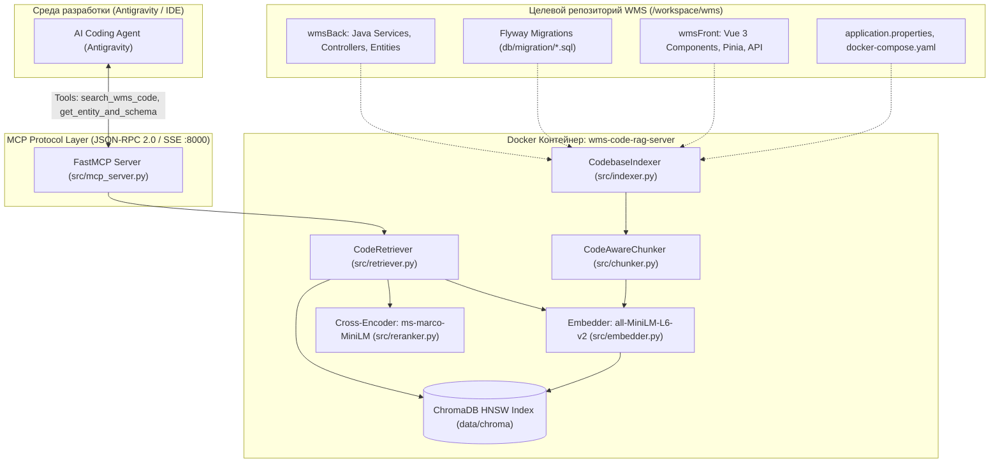

# WMS Codebase RAG MCP Server

Интеллектуальная система семантического поиска и индексации кодовой базы WMS (`inbound-storage-dispatch`) через протокол **Model Context Protocol (MCP)** для AI-агентов разработки.

---

## 1. Архитектура и поток данных



---

## 2. Структура проекта и назначение файлов

```
wms-code-rag/
├── Dockerfile                   # Сборка контейнера на базе python:3.11-slim (non-root appuser)
├── docker-compose.yml           # Декларация сервиса с volume-монтированием WMS кодовой базы
├── requirements.txt             # Зависимости: mcp, chromadb, sentence-transformers, torch, pydantic
├── config.yaml                  # Конфигурация путей, моделей эмбеддингов, реранкера и портов
├── run_docker.bat               # Запуск в Docker в один клик
├── run_local_sse.bat            # Запуск локально по HTTP/SSE
├── run_local_stdio.bat          # Запуск локально через stdio
└── src/
    ├── __init__.py
    ├── config.py                # Pydantic-модели валидации настроек + env overrides
    ├── chunker.py               # Интеллектуальный чанкер для кода (Java, SQL, Vue, Markdown)
    ├── embedder.py              # Векторизация текста (SentenceTransformers + потокобезопасный LRU-кэш)
    ├── vector_store.py          # Интеграция с постоянным хранилищем ChromaDB (HNSW, косинусная метрика)
    ├── reranker.py              # Кросс-энкодер для переранжирования кандидатов (высокая точность)
    ├── indexer.py               # Сканер кодовой базы (парсинг файлов, генерация чанков и сохранение)
    ├── retriever.py             # Оркестратор: Запрос -> Векторный поиск -> Фильтры -> Реранкинг
    └── mcp_server.py            # FastMCP сервер с регистрацией инструментов для AI-агента
```

---

## 3. Доступные MCP-инструменты (Tools)

AI-агент вызывает эти инструменты в фоне при решении задач:

1. `search_wms_code(query: str, top_n: int = 4)`  
   Семантический поиск по Java-сервисам, контроллерам, Vue-компонентам и конфигурациям. Возвращает точный файл, строки и исходный код.
2. `get_entity_and_schema(table_or_entity: str)`  
   Поиск DDL-схемы, миграций Flyway и связей таблиц для конкретной сущности базы данных.
3. `search_wms_security(topic: str)`  
   Специализированный поиск по безопасности: `@PreAuthorize`, фильтры JWT, проверка ролей, загрузка файлов, CORS.
4. `get_rag_status()`  
   Возвращает текущую статистику индекса (количество проиндексированных чанков, путь, статус моделей).
5. `reindex_wms_codebase()`  
   Принудительное полное переиндексирование репозитория WMS при внесении масштабных изменений.

---

## 4. Как запустить

### Вариант 1: В Docker (Рекомендуемый)
Дважды кликните по `run_docker.bat` или выполните:
```powershell
docker compose up -d --build
```
Сервер запустится в изолированном контейнере на порту `8000`. При первом запуске он автоматически проиндексирует репозиторий WMS.

### Вариант 2: Локально через Python
```powershell
pip install -r requirements.txt
python src/mcp_server.py --transport sse --host 127.0.0.1 --port 8000 --auto-index
```

---

## 5. Руководство по анализу чужого RAG / MCP кода

Когда вы открываете любой чужой проект с RAG или MCP, используйте следующий чек-лист:

1. **Где точка входа (Entrypoint)?**
   * В MCP-проектах ищите инициализацию `FastMCP(...)` или `Server(...)` — там зарегистрированы функции с декоратором `@mcp.tool()`. Именно они определяют возможности сервера.
2. **Как устроен чанкинг (Chunking Strategy)?**
   * Обычный `RecursiveCharacterTextSplitter` ломает код. В зрелых проектах ищите специализированные сплиттеры по AST, регуляркам или сигнатурам функций (`chunker.py`).
3. **Какая модель эмбеддингов (Embeddings)?**
   * Обращайте внимание на размерность векторов (dimension) и поддерживаемые языки. Для кода отлично подходят `sentence-transformers/all-MiniLM-L6-v2` или `bge-m3`.
4. **Есть ли реранкер (Reranker)?**
   * Простой векторный поиск часто выдает шум. Наличие Cross-Encoder (`reranker.py`) — признак качественного Production-grade RAG.
5. **Где хранятся векторы (Persistence)?**
   * Проверьте, персистентна ли база (например, `ChromaDB PersistentClient` с папкой на диске или `pgvector`), иначе при перезапуске контейнера придется заново эмбеддить весь код.
